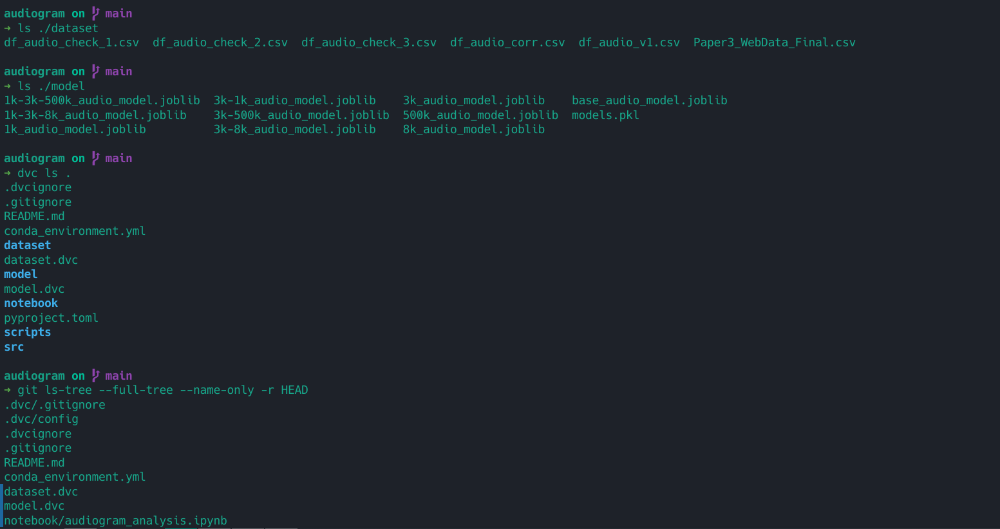
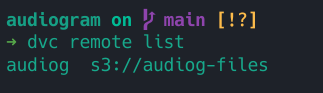

# Audiogram Predict
This is a Machine Learning project to predict new frequencies values  
<br>
## Installation
To install required packages:
```
./scripts/install.sh
```

## Execution
To execute the application run:
```
poetry run streamlit run src/main.py
```

## Versioning

Experiments: Conda Environment (conda_environment.yml)

```
notebook/
```
  
Script: Poetry (pyproject.toml)
```
src/
```

Data: DVC connected on AWS S3 Bucket (.dvc/)
```
dataset/
model/
```


Files tracked by Git and DVC:


DVC connection to AWS S3:  

<br>

## Modeling
The application is served by KNN models to predict the best value.
The machine learning pipeline follow the best correlation from the input combination.
E.g.: For the combination '2k' - '4k' - '6k' the most correlated is the '3k' and the next prediction.

Machine Learning Pipelines:

- Comb: 2k-4k-6k -> 3k  

- Comb: 2k-4k-6k-1k -> 3k  
Comb: 2k-4k-6k-3k -> 1k  
Comb: 2k-4k-6k-8k -> 3k  
Comb: 2k-4k-6k-500k -> 3k  

- Comb: 2k-4k-6k-8k-3k -> 1k  
Comb: 2k-4k-6k-1k-3k -> 500k  
Comb: 2k-4k-6k-500k-3k -> 1k  

- Comb: 2k-4k-6k-500k-3k-1k -> 8k  
Comb: 2k-4k-6k-8k-3k-1k -> 500k  

## Experiments
In order to run the notebooks run:
Create a new conda environment and activate:
```
conda create -n cond_audio_env python=3.10
conda activate cond_audio_env
```

Install the required dependencies:
```
conda env update --file conda_environment.yml
```

Open Jupyter
```
jupyter-notebook
```
